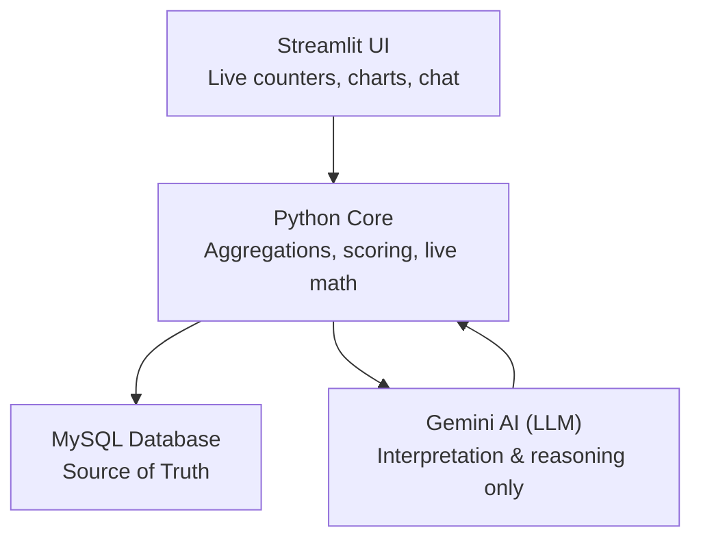

# 🌍 AI Economics Dashboard — Global Intelligence Platform

A **professional-grade economic intelligence system** designed to transform validated macroeconomic data into **live, explainable, and decision-ready insights**.

Built with **Streamlit + MySQL + Gemini (AI Analyst)**, this platform delivers **World, Continent, and Country-level intelligence** using a deterministic, database-first architecture.

> **Core Rule**
>
> **Database = Facts**  
> **AI = Interpretation (never data generation)**

---

## 🚀 Key Innovation: Advanced AI Country Dashboard

The centerpiece of this platform is the **AI-Analyst Integration Layer**, which transforms static indicators into a **collaborative economic research environment**.

### What makes it different
- **Deep-Dive Country Intelligence**  
  Unified narrative covering GDP, inflation, population, debt, trade, and defense.
- **Contextual Economic Chat**  
  Query the database using natural language  
  _Example_:  
  > “Compare India and China’s GDP growth over the last decade”
- **Dynamic Visual Intelligence**  
  AI selects the most relevant **2×2 Plotly chart layouts**, while data is always fetched from MySQL.
- **Interpretation over Guessing**  
  AI never invents numbers — it explains verified data only.

---

## 🎯 Project Vision

Most economic dashboards fail because they:
1. Show **static numbers without context**
2. Depend on **unstable APIs or hallucinated forecasts**

This platform solves both by combining:
- **Database-first economic truth**
- **Live, mathematically correct counters**
- **AI as an analyst, not an oracle**

If the database is updated yearly, the system remains accurate **indefinitely**.

---

## 🧱 Architecture Overview

Below is a clean flow diagram showing how the system components interact.

---

## 🌍 Application Pages

### 1️⃣ World Intelligence
- 🌐 Live World GDP (per-second)
- 👥 Live World Population
- 📈 Nominal vs Real Growth
- 💰 World GDP per Capita (live)
- 🛡 Global Military Expenditure Map
- 🌎 Continent-wise breakdown

---

### 2️⃣ Continent Intelligence
- Continent GDP (Nominal)
- Share of World GDP (%)
- Top contributing countries
- GDP concentration analysis
- Regional population & growth

_All continent values are mathematically derived from country baselines._

---

### 3️⃣ Country Intelligence (Core)
- Country profile (flag, ISO, capital, continent)
- **Live GDP (8-decimal precision)**
- **Live Population**
- GDP per capita (derived live)
- Inflation, unemployment, debt-to-GDP
- Military spending & trade balance
- Share of continent GDP
- Share of world GDP
- AI-assisted economic analysis
- CSV export for reports

---

## ⏱️ Live Counter Engine (Deterministic)

### GDP Live Formula
nominal_growth = real_growth + inflation

live_gdp =
base_gdp × (1 + nominal_growth × elapsed_seconds / seconds_in_year)

### Design Decisions
- Base values are treated as **Jan 1 of the current year**
- Smooth per-second interpolation
- ±0.01% jitter for realism
- Automatic year rollover (no code changes)

---

## 🧠 AI Integration — Gemini Economic Analyst

### AI DOES NOT
- ❌ Store data
- ❌ Modify database values
- ❌ Invent GDP or population

### AI DOES
- ✅ Interpret trends
- ✅ Explain risks & strengths
- ✅ Compare countries
- ✅ Decide best chart layouts
- ✅ Answer structured economic questions

---

## 🗄️ Data Layer (Source of Truth)

### Core Tables

#### `countries`
| Field | Description |
|------|-------------|
| country_id | Primary key |
| name | Country name |
| iso2 / iso3 | ISO codes |
| capital | Capital city |
| continent_code | AS, EU, NA, etc |

---

#### `economic_indicators`
| Field | Description |
|------|------------|
| country_id | FK |
| year | Year |
| gdp | Nominal GDP (USD) |
| gdp_growth | Real GDP growth % |
| inflation | CPI % |
| unemployment | % |
| debt_gdp | % |
| military_spending | USD |

---

#### `country_population`
| Field | Description |
|------|------------|
| country_id | FK |
| year | Year |
| population | Population |
| population_growth | % |

---

#### `continent_nominal_gdp`
| continent_code | year | gdp_usd (billions) |

#### `more DB table`

---

## 🔄 Yearly Update Process

Every **January 1st**:
1. Load previous year’s finalized data
2. Update base tables
3. Live counters auto-adjust
4. No code changes required

---

## ⚙️ Strategic Engineering Decisions

### Why not direct IMF APIs?
- SDMX APIs are unstable and rate-limited

**Solution**
- IMF WEO CSV ingestion → MySQL
- Deterministic, auditable, reproducible

---

## 📈 Machine Learning

- **Economic Health Score (0–100)**
  - Growth, inflation, debt, unemployment, reserves
- **GDP Growth Forecast**
  - Linear regression (short-term)
- **Country Risk Rating**
  - Volatility & trend-based scoring

---

## 🔐 Security & Configuration

- Secrets stored in `.env` (never committed)
- `.env.example` for documentation
- Role-based auth scaffold (user/admin)
- Database-first reads for stability

---

## 🏁 Design Principles

- **Truth over aesthetics**
- **Derivation over duplication**
- **AI as analyst, not oracle**
- **Simple math, correct math**
- **Scalable by design**

---

## 📌 Final Note

This is **not a toy dashboard**.

It is a **foundational economic intelligence system** designed to scale into:
- Financial research
- Policy analysis
- Geopolitical risk modeling
- Institutional reporting

---

**AI Economics Dashboard**  
_Where data becomes understanding._
